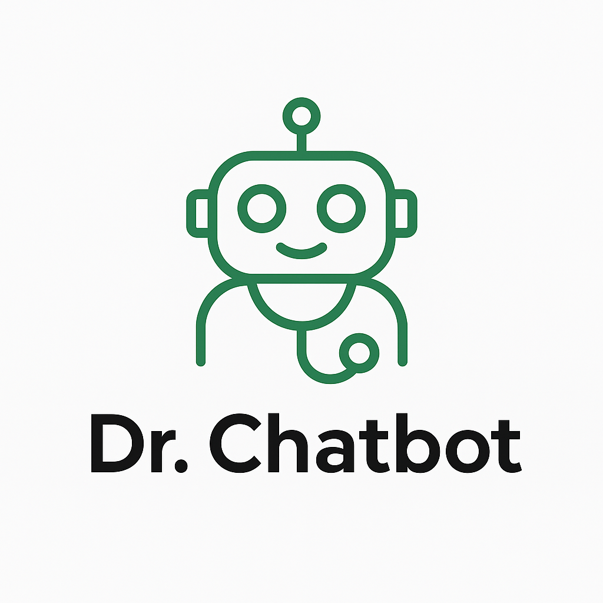
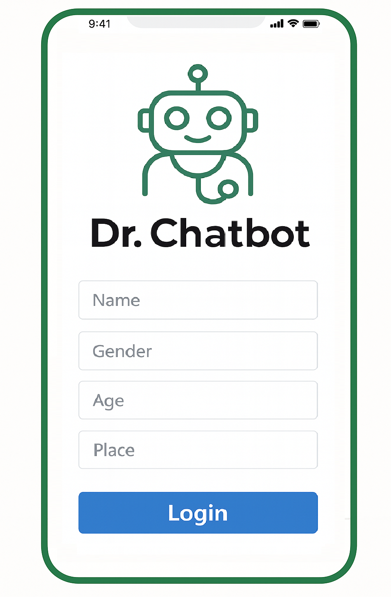
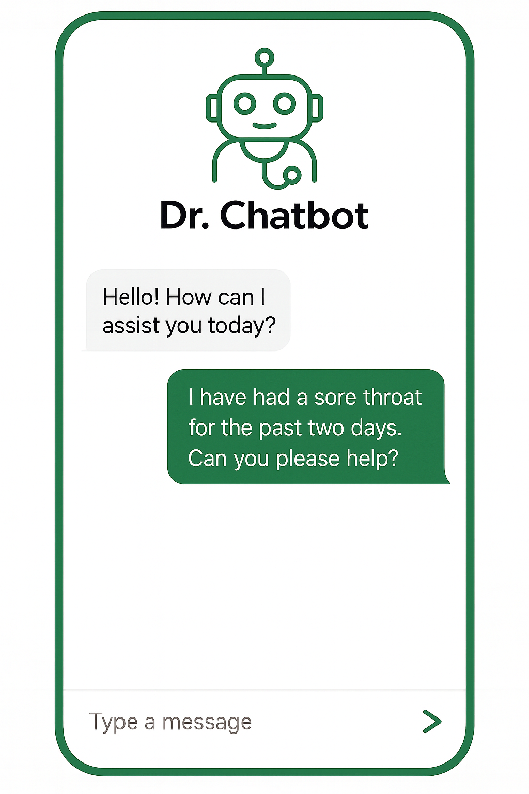
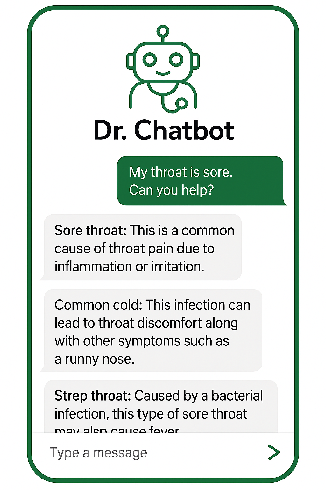
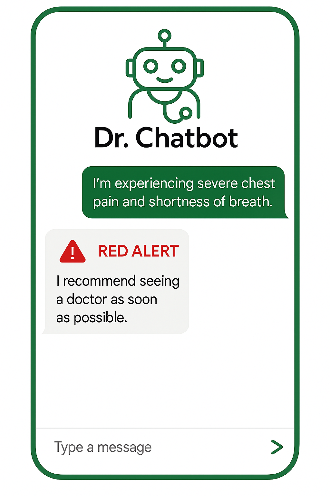
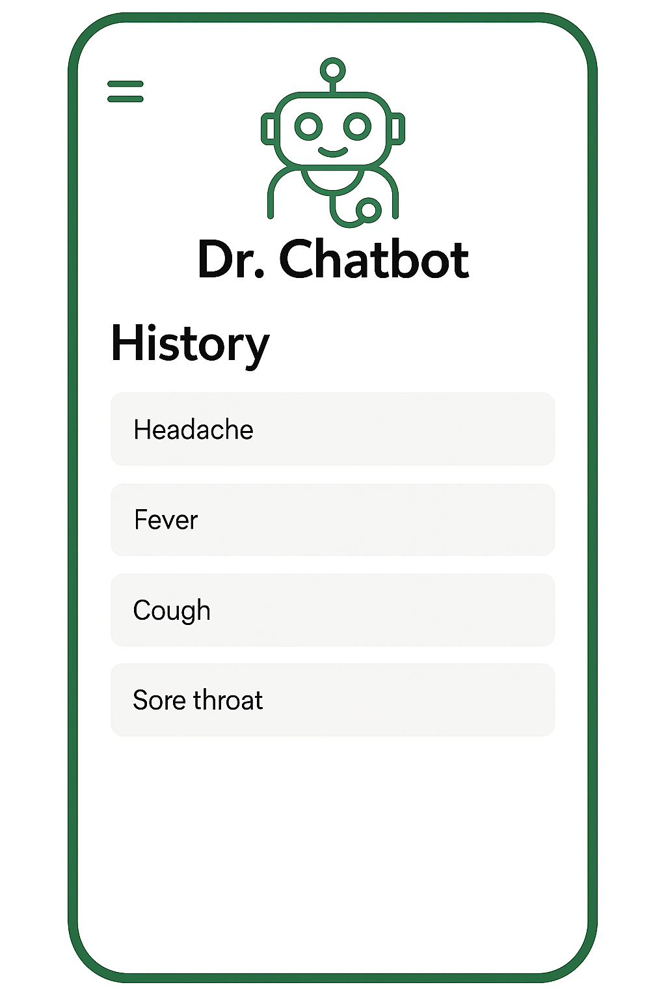

# Dr. Chatbot

An AI-assisted symptom checker and telehealth companion app. A user describes how they
feel in plain language; the backend extracts clinical entities, predicts likely
conditions, flags emergency red-flag symptoms, and returns short guidance.

Built for **CSE327 – Software Engineering**, North South University.

> **Disclaimer:** This is a university project. It is not a medical device and must not
> be used for diagnosis or treatment. Always consult a qualified clinician.

---

## Screenshots

| Home | Login | Chat |
|---|---|---|
|  |  |  |

| Possible causes | Red alert | History |
|---|---|---|
|  |  |  |

---

## Features

- Free-text symptom entry in natural language
- Biomedical named-entity recognition to pull symptoms out of the message
- Disease prediction from the extracted symptom set
- Red-flag detection for emergency symptoms, surfaced as an alert
- Short, plain-language advice generated per conversation
- Firebase email/password authentication
- Conversation history per user

---

## Architecture

```
Flutter app  ──HTTP/JSON──>  Flask API  ──>  NLP pipeline
(Android/iOS/Web)              /chat          ├─ NER: d4data/biomedical-ner-all
     │                                        ├─ Classifier: zero-shot / XGBoost
     └── Firebase Auth                        └─ Advice: fine-tuned FLAN-T5
```

## Tech stack

| Layer | Technology |
|---|---|
| Frontend | Flutter (Dart), Material |
| Auth | Firebase Authentication |
| Backend | Python, Flask |
| NLP | Hugging Face Transformers, PyTorch |
| Classical ML | scikit-learn, XGBoost |

---

## Repository layout

```
dr-chatbot/
├── app/            Flutter client (Android, iOS, web, desktop targets)
│   └── lib/
│       ├── main.dart
│       └── screens/        home, login, signup
├── backend/        Flask API
│   ├── app.py              /chat endpoint
│   ├── train_drchatbot.py  fine-tuning script for the advice model
│   ├── data/               seed dataset
│   └── experiments/        model spike scripts (NER, zero-shot, translation, BioBERT)
├── ml/             Disease classifier
│   ├── data/               raw, processed, and training CSVs
│   ├── scripts/            symptom extraction, feature building, training
│   └── *.pkl               trained Random Forest and XGBoost models
├── docs/           Project proposal and screenshots
└── archive/        Earlier Flutter prototype, kept for reference
```

---

## Getting started

### Prerequisites

- Python 3.11
- Flutter SDK 3.24 or newer
- A Firebase project with Email/Password sign-in enabled

### 1. Backend

```bash
cd backend
python -m venv .venv
# Windows
.venv\Scripts\activate
# macOS / Linux
source .venv/bin/activate

pip install -r ../requirements.txt
python app.py
```

The API starts on `http://127.0.0.1:5000`. On first run, Transformers downloads the
pretrained models from Hugging Face, which takes a few minutes.

Test it:

```bash
curl -X POST http://127.0.0.1:5000/chat \
  -H "Content-Type: application/json" \
  -d '{"message":"I have had a fever and a bad headache for two days"}'
```

### 2. Firebase configuration

Firebase config files are deliberately **not** in this repository. Generate your own:

```bash
dart pub global activate flutterfire_cli
cd app
flutterfire configure
```

That writes `lib/firebase_options.dart` and the platform config files
(`android/app/google-services.json`, `ios/Runner/GoogleService-Info.plist`), all of
which are gitignored.

### 3. Flutter app

```bash
cd app
flutter pub get
flutter run
```

If you are testing on an Android emulator, the backend is reachable at
`http://10.0.2.2:5000`, not `127.0.0.1`. On a physical device, use your computer's LAN
IP and make sure Flask is started with `host="0.0.0.0"`.

### 4. Disease classifier (optional)

```bash
cd ml/scripts
python extract_symptoms.py
python features.py
python train_model.py
```

---

## Model weights

The fine-tuned FLAN-T5 advice model (~300 MB) is not stored in Git. See
[docs/MODELS.md](docs/MODELS.md) for how to obtain or retrain it.

---

## Team

| Name | Role |
|---|---|
| Shafaat Bin Zaman | — |
| Sadia Eva | — |
| Zaima Hossain | — |

Supervised under CSE327, North South University.

## License

Released under the MIT License. See [LICENSE](LICENSE).
